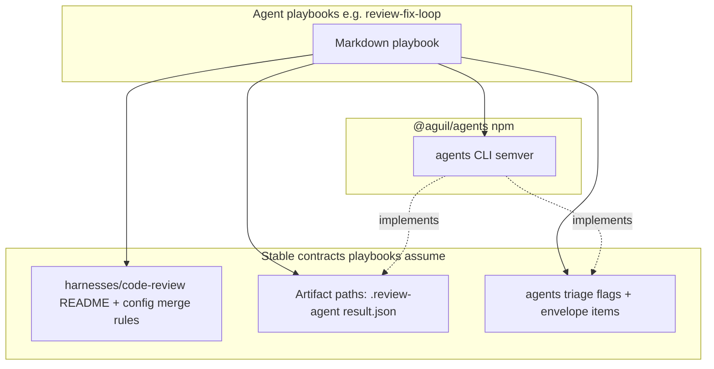

# Packaging and distributing agent skills with `@aguil/agents` (provider-agnostic)

## Design principle

Skills are **portable playbook documents** (Markdown, optionally with YAML frontmatter for tools that consume it). They are **not** tied to a single IDE or agent host. Any product (Cursor, Claude Code, custom runners, CI bots) can **ingest the same files** by path, submodule, raw git URL, or copied into that product’s own skill/plugin directory—**without** the `agents` repo encoding those host paths.

## Current state

**Published CLI** ([distribution/npm/cli-package.manifest.json](../../distribution/npm/cli-package.manifest.json)) ships:

- `dist/agents` (Bun launcher) and `dist/index.js` (bundle)
- **`docs/skills/`** (playbooks + [skills.json](../../docs/skills/skills.json)), copied by [scripts/prepare-npm-publish.ts](../../scripts/prepare-npm-publish.ts) into the npm pack alongside `dist/`
- `README.md` (from [README.npm.md](../../README.npm.md)) and `LICENSE`

Canonical playbooks live under **[`docs/skills/`](../../docs/skills/README.md)** in git. **Supported install path:** **`agents skills install <id>`** (see **`agents skills --help`**) which reads **`docs/skills/skills.json`** and copies into the operator’s global **`~/.agents/skills/<id>/`** by default. **`agents skills list`** prints the manifest; **`agents doctor`** checks **`agents --version`** vs each skill’s **`minAgentsVersion`** (see **`agents doctor --help`**).

There is **no** separate `@aguil/agents-skills` npm package and **no** maintained third-party CLI (e.g. `npx skills add`) install path in this repository’s docs.

## Interdependency map

- **Playbook → CLI:** Commands (`agents code-review`, `agents triage`), flags (`--from`, `--result`, `--stdout`, etc.), and exit semantics.
- **Playbook → harness docs:** e.g. merged config / no fabricated adapter rules → [harnesses/code-review/README.md](../../harnesses/code-review/README.md).
- **Playbook → artifact layout:** `.review-agent/`, `.agents-triage/`, `result.json` / `triage-queue.json` (schemas in `@aguil/agents-triage` / `@aguil/agents-core`).
- **CLI does not depend on playbooks at runtime:** No import of skill bodies for harness execution; **`agents skills`** reads markdown only for install/list, and **`agents doctor`** reads **`skills.json`** for semver checks.

**Portability gap:** Embedded references to **one user’s absolute paths** or **one vendor’s skill directory** break cloning and other agents. Prefer **repository-relative paths**, **environment variables**, or **stable documentation URLs**.

## Distribution options (reference)

### 1. Repo-canonical playbooks (baseline)

- **Mechanism:** Store playbooks under **`docs/skills/<id>/SKILL.md`**.
- **Pros:** Version with git; provider-agnostic; readable in any editor.

### 2. Ship playbooks inside the `@aguil/agents` tarball

- **Mechanism:** Include **`docs/skills/`** in npm **`files`** and copy in **prepare-npm-publish** (implemented).
- **Pros:** Single semver artifact: CLI + playbooks + manifest.

### 3. Optional: separate npm package (not used)

A dedicated skills-only package was **removed** in favor of **`agents skills`** + tarball **`docs/skills/`**.

## Skill install locations (providers `agents` integrates with)

The **code-review harness** shells out to host CLIs via `OpenCodeAdapter`, `ClaudeCodeAdapter`, and `CursorAdapter` ([packages/execution/src/index.ts](../../packages/execution/src/index.ts)): it sets **`cwd` to the workspace** and does **not** read skill directories. Skill paths matter for **operators** wiring playbooks into each product—not for the subprocess argv builder.

Existing **aguil CLI user config** lives under XDG-style **`~/.config/agents/`** (e.g. `code-review/config.json` per [harnesses/code-review/README.md](../../harnesses/code-review/README.md)). That is separate from **Agent Skills** markdown trees below.

### Cursor (Cursor Agent)

Per [Cursor Agent Skills](https://cursor.com/docs/skills), skills are discovered from:

| Scope | Path |
| --- | --- |
| Project | `.agents/skills/`, `.cursor/skills/` |
| User (global) | `~/.agents/skills/`, `~/.cursor/skills/` |

For compatibility, Cursor **also** loads `.claude/skills/`, `.codex/skills/` and the corresponding user-level paths.

**Default for `agents skills install`:** **`~/.agents/skills/<skill-id>/SKILL.md`** (Windows: **`%USERPROFILE%\.agents\skills\<skill-id>\`**).

### Claude Code (`claude` CLI)

Per [Claude Code skills](https://docs.anthropic.com/en/docs/claude-code/skills):

| Scope | Path |
| --- | --- |
| Personal (global) | `~/.claude/skills/<name>/SKILL.md` |
| Project | `.claude/skills/<name>/SKILL.md` |
| Plugin | plugin’s own `skills/` tree |

### OpenCode (`opencode` CLI)

Per [OpenCode config](https://open-code.ai/en/docs/config), `.opencode` and `~/.config/opencode` include **`skills/`**; **`OPENCODE_CONFIG_DIR`** can redirect. **`instructions`** can also reference arbitrary markdown paths.

### Windows (path equivalents)

| Unix-style (docs / Git Bash) | Typical Windows path (same layout) |
| --- | --- |
| `~/.agents/skills/<id>/` | `%USERPROFILE%\.agents\skills\<id>\` |
| `~/.cursor/skills/<id>/` | `%USERPROFILE%\.cursor\skills\<id>\` |
| `~/.claude/skills/<id>/` | `%USERPROFILE%\.claude\skills\<id>\` |
| `~/.config/agents/` (CLI JSON) | `%USERPROFILE%\.config\agents\` |
| `~/.config/opencode/` (global OpenCode dir) | `%USERPROFILE%\.config\opencode\` |

Project-relative paths are **unchanged** on Windows; only **user-global** trees sit under **`%USERPROFILE%`**.

## Recommendations

1. **Canonical path:** **`docs/skills/`** in git; **`.cursor/skills/`** only as an optional local symlink/copy for Cursor discovery.
2. **Install path:** document **`agents skills install`** only; keep **`minAgentsVersion`** in **`docs/skills/skills.json`** for **`agents doctor`**.
3. **Published tarball:** keep **`docs/skills/`** in the npm **`files`** list so global installs retain playbooks.

## Future playbooks

Same contract: declare CLI + schema assumptions; avoid host-specific paths; extend **`skills.json`** when adding skill ids.

## Optional follow-ups

- Add **`agents skills install --target <dir>`** if operators need non-default destinations without hand-editing copies.
- Expand **`agents doctor`** to validate skill markdown mentions only existing CLI flags (deeper contract tests).
